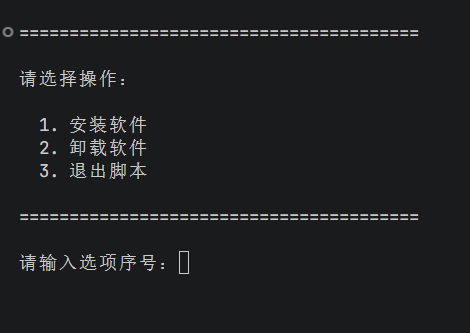
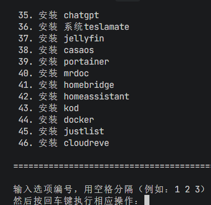
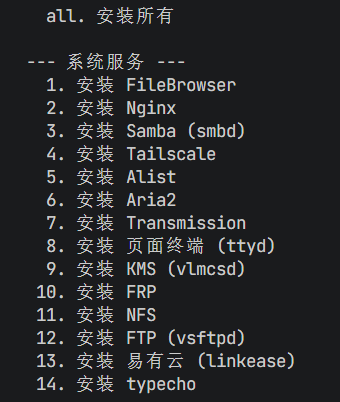

# hinas







#### 介绍

hinas 是一款专为海纳思系统打造的软件包管理工具，提供简洁的一键安装/卸载体验。

#### 功能特点

**软件包管理**
- 支持 17+ 款常用软件一键安装（FileBrowser、Nginx、Samba、Tailscale、Alist、Aria2、Transmission 等）
- 支持 16+ 款 Docker 应用快速部署（青龙面板、Jellyfin、HomeAssistant、WordPress、MySQL 等）
- 批量安装/卸载功能，可一次选择多个软件
- 交互式菜单操作，使用简单直观

**Docker 镜像源优化**
- 内置多家 Docker 镜像源测速功能
- 自动选择最快镜像源
- 支持手动指定镜像源

#### 支持的软件

| 分类 | 软件列表 |
|------|----------|
| 系统服务 | Nginx、Samba、FTP、NFS、KMS |
| 网络工具 | Tailscale、FRP、DDNS |
| 文件管理 | FileBrowser、Alist、Cloudreve、H5ai |
| 下载工具 | Aria2、Transmission |
| Web 应用 | typecho、WordPress、HomeAssistant |
| 容器应用 | 青龙面板、Jellyfin、Portainer、MySQL |

#### 使用方法

```bash
# 安装软件
bash hinas_install_uninstall.sh
# 选择 1 进入安装菜单，选择对应序号即可安装

# 卸载软件
bash hinas_install_uninstall.sh
# 选择 2 进入卸载菜单，选择对应序号即可卸载

# Docker 镜像源测速
bash check_docker_registry.sh
```
